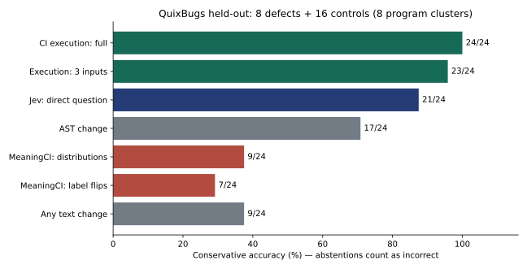

# MeaningCI Code

Does comparing behavioral decision probes across two code versions detect regressions better than simply asking a model whether the code changed? This repository measures that question on public QuixBugs programs, with execution tests as the conventional baseline.

This is a separate code experiment. It inherits **no accuracy claims** from MeaningCI's text benchmark. It does not prove program equivalence or generate repairs.

## Measured result

Held-out test: 24 pairs from 8 program clusters (8 defects, 16 preserving controls), authenticated Jev 1.13.0.

| Method | Correct | Conservative accuracy | Abstentions |
|---|---:|---:|---:|
| Conventional CI tests | 24/24 | 100% | 0 |
| Direct Jev question | 21/24 | 87.5% | 2 |
| MeaningCI distributions | 9/24 | 37.5% | 13 |
| MeaningCI label flips | 7/24 | 29.2% | 15 |

**The probe architecture loses to simpler direct judgment and execution tests in this experiment.** Abstentions count as incorrect; this avoids presenting selective coverage as full accuracy. MeaningCI distributions also produce 2 false alarms. Its accuracy difference versus direct Jev is -50 percentage points (program-cluster bootstrap 95% interval: -75 to -25). Small public algorithms and eight held-out clusters do not establish production readiness for any method.



Read the [full report](reports/benchmark_report.md) and [saved summary](runs/main/summary.json), including limits, failures and exploratory paired statistics. The practical recommendation is to keep execution tests as the base and investigate direct model judgment only as supplementary triage.

## Reproduce measured results without API credits

Python 3.9+; Git is needed only to download upstream again. The pinned benchmark inputs, license and authenticated native response recordings are included.

```sh
python -m venv .venv
# Windows: .venv\Scripts\activate
# Linux/macOS: source .venv/bin/activate
python -m pip install -e ".[test]"
python scripts/verify_artifacts.py runs/main
python scripts/run_benchmark.py --recordings benchmark/recordings --reuse-execution runs/main --output runs/reproduction
python scripts/analyze_results.py runs/reproduction
python -m pytest -q
```

To repeat execution instead of replaying measured execution outcomes, omit `--reuse-execution`. Runtime timeouts depend on hardware and load. New executions belong in a new run directory; keep the measured reference run intact.

Rebuild the identical dataset from its official upstream revision:

```sh
python scripts/download_dataset.py
python scripts/build_dataset.py
python scripts/verify_artifacts.py
```

For new authenticated API measurements, set `TYPESAFE_API_KEY` in the process environment, then run `python scripts/collect_jev.py --output benchmark/recordings-new`. Requests retry at most three times with 1/2-second backoff for HTTP 429/5xx and network timeouts; authorization and invalid response failures stop explicitly. No mock substitution. New model collections must be analyzed as a separate run. Main captures were collected through the already-authenticated official TypeSafe Playground without creating/exporting an API key; input JSON was copied back and verified before submission.

## Dataset and evaluated methods

- Official [QuixBugs](https://github.com/jkoppel/QuixBugs), revision `4257f44b0ff1181dedaedee6a447e133219fcebf`, MIT license retained under `benchmark/upstream/LICENSE`.
- All 31 programs with JSON fixtures; the nine graph-object algorithms are listed as excluded in metadata. These are small algorithm challenge defects, not real production commits.
- 93 pairs: 31 upstream bugs (correct implementation A → defective implementation B), 31 presentation controls and 31 local-variable-renaming controls. Controls are generated here, not claimed as upstream benchmark cases.
- 15/8/8 program-disjoint development/validation/test clusters. Related variants remain together. Held-out test has 24 pairs: 8 defects and 16 controls.
- Three official inputs chosen deterministically by an input-only hash. Four fixed predicates per input: exception, truthiness, equals first input, output length equals first-input length. Neither outputs, failing cases nor code differences generate probes.
- `text-change` / `ast-change`: naive structural controls, not competitive semantic analyzers.
- `tests-budget-3` / `tests-full`: conservative behavioral execution comparison, abstaining on timeout.
- `ci-tests-budget-3` / `ci-tests-full`: conventional CI budget controls that also flag candidate timeouts where the reference passes.
- `jev-direct`: one direct code-pair change decision using the same Jev model.
- `meaningci-label`: confident answer flips across A/B behavioral probes.
- `meaningci-jsd`: full-vector Jensen–Shannon divergence in bits; threshold selected on validation, confidence gate fixed before inference.

All model questions share the same code-pair context in a combined batch. This controls provider/model and evidence differences, but is not standalone direct-model timing or an independent source checksum experiment. Raw native vectors, reported choices, rounding normalization, token usage, resolved model, engine latency, UI wall time and request identifiers remain inspectable in the captures.

## Evidence and limitations

`runs/main/report.md` and `reports/benchmark_report.md` contain the measured result, raw counts and adverse findings. `summary.json` includes coverage, conservative accuracy, F1, exploratory program-cluster bootstrap intervals and exact paired McNemar results. Eight held-out program clusters give limited statistical power. Pair-level McNemar independence is imperfect; results are exploratory.

Gold fixture outputs and benchmark labels are loaded by the evaluator after prediction. They never reach Jev. `ORACLE` diagnostics report input/predicate coverage, not method performance. Upstream source timeouts and candidate failures are retained, not manually repaired or deleted.

Public algorithm benchmarks may be present in model training data. This experiment cannot establish commercial demand, enterprise readiness, broad code understanding or superiority to a general-purpose code-review LLM. No such LLM credentials are configured; that baseline is explicitly unmeasured. No per-method standalone cost or latency is inferred from shared batches, and replay time is not inference time.

Pinned benchmark programs execute in isolated Python processes with a timeout, **not a security sandbox**. Do not use this harness to run arbitrary uploaded code. A public service would require container/OS isolation, restricted network/filesystem, quotas, authentication and retention controls.

See `docs/architecture.md`, `docs/protocol-amendments.md` and `STATUS.md` for design, disclosed amendments and completed milestones.
